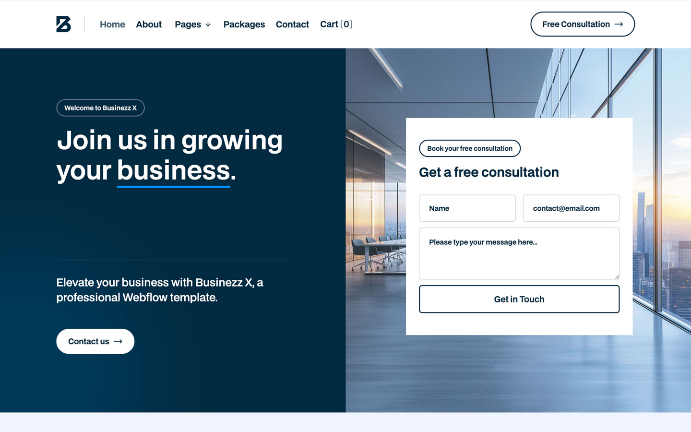

# Domo Challenge
El desarrollo de esta página se realizó desde el punto de vista First Mobile, para garantizar fluidez y una agradable interacción para el usuario, adaptable a varios dispositivos. Se agregó animaciones en el menú hamburguesa, el dropdown, los botones (los que tienen flecha y los que no), y animación de cargado al iniciar en la página.

## Imagen de referencia

## Tecnologías utilizadas 
       

## Otras herramientas 
- <https://jonsuh.com/hamburgers/>
- <https://fontawesome.com/>

## Animaciones integradas

